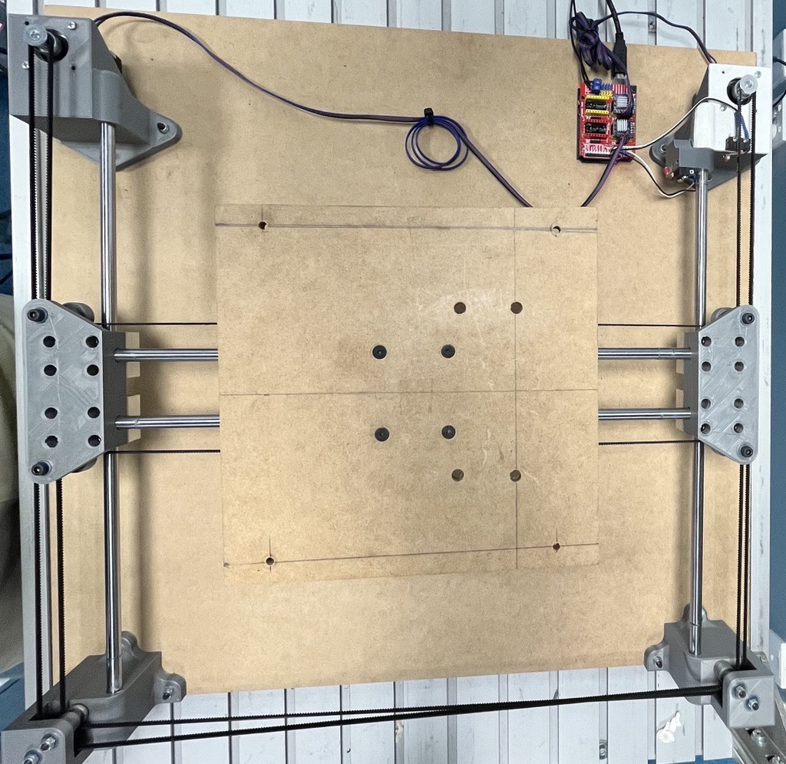

# The QCR Ouija Board



## What is this?
This is an interface to move the platform onboard the Ouija Board built by Ben Burgess-Limerick at QUT's center for robotics.

## Things to Know
- The board is locked by default. You must unlock it before you can move it.
- On Linux, you must give the user permission to access the serial port. You can do this by adding the user to the `dialout` group or by chmoding the serial port to 666.
 - ```
    sudo usermod -a -G dialout "$USER"
    sudo chmod a+rw /dev/ttyACM0
    ``` 
- On Linux the port is usually `/dev/ttyACM0` and on Windows it is usually `COM5`
- There is no way of knowing the current position of the platform.
- There is no way of knowing when an operation is completed.
- The Arduino on the board is running [GRBL](https://github.com/grbl/grbl) with feedback turned off.

## Example
```python
from ouija.ouija import OuijaBoard
board = OuijaBoard()
board.unlock_and_calibrate()
board.move_to(100, 0)
board.move_to(100, 100, speed=1000)
```
